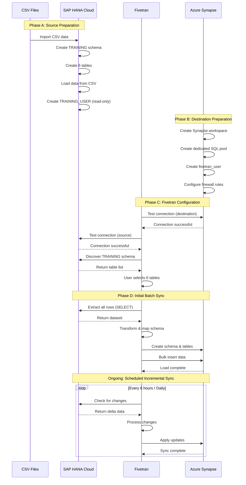
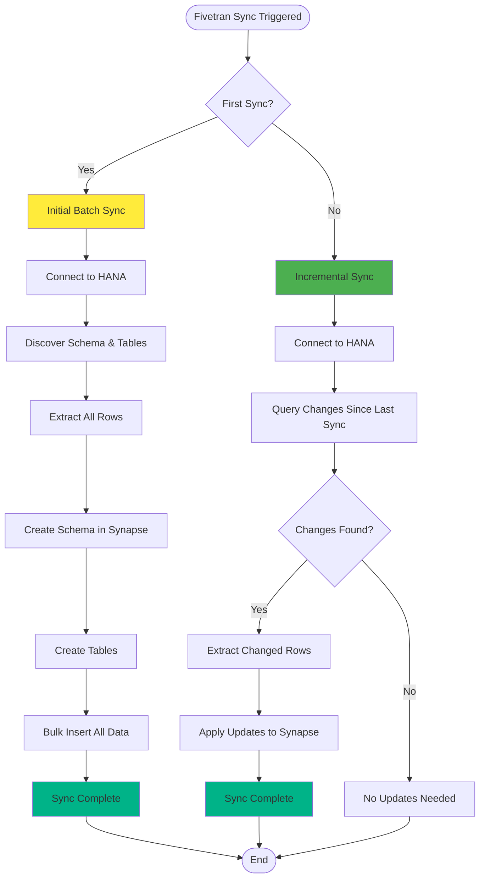

# System Architecture - SAP BTP to Azure Synapse Integration

## Overview

This document describes the technical architecture for batch data integration from SAP HANA Cloud (BTP) to Azure Synapse Analytics using Fivetran as the middleware integration platform.

---

## Architecture Diagram (ASCII)

```
┌─────────────────────────────────────────────────────────────────────────┐
│                         BATCH DATA INTEGRATION                           │
└─────────────────────────────────────────────────────────────────────────┘

┌──────────────────────┐          ┌──────────────────────┐          ┌──────────────────────┐
│   SOURCE SYSTEM      │          │  INTEGRATION LAYER   │          │   TARGET SYSTEM      │
│   (SAP BTP)          │          │     (FIVETRAN)       │          │   (MICROSOFT AZURE)  │
│                      │          │                      │          │                      │
│  ┌────────────────┐  │          │  ┌────────────────┐  │          │  ┌────────────────┐  │
│  │  HANA Cloud    │  │          │  │  SAP HANA      │  │          │  │ Azure Synapse  │  │
│  │  Database      │  │◄─────────┼──│  Connector     │  │          │  │  Analytics     │  │
│  │                │  │  Extract │  │                │  │  Load    │  │                │  │
│  │  Schema:       │  │  (Pull)  │  │  - Schema Map  │  ├─────────►│  │  SQL Pool:     │  │
│  │  TRAINING      │  │          │  │  - Transform   │  │          │  │  fivetran_     │  │
│  │                │  │          │  │  - Scheduler   │  │          │  │  demo_pool     │  │
│  │  Tables:       │  │          │  │                │  │          │  │                │  │
│  │  - DEPARTMENTS │  │          │  └────────────────┘  │          │  │  Schema:       │  │
│  │  - JOBS        │  │          │                      │          │  │  sap_hana_     │  │
│  │  - EMPLOYEES   │  │          │  ┌────────────────┐  │          │  │  training      │  │
│  │  - JOB_HISTORY │  │          │  │  Sync Engine   │  │          │  │                │  │
│  │  - ATTENDANCE  │  │          │  │                │  │          │  │  Tables:       │  │
│  │  - PAYROLL     │  │          │  │  - Initial Sync│  │          │  │  - departments │  │
│  │                │  │          │  │  - Incremental │  │          │  │  - jobs        │  │
│  │  Access:       │  │          │  │  - Schedule    │  │          │  │  - employees   │  │
│  │  TRAINING_USER │  │          │  │    (6hr/Daily) │  │          │  │  - job_history │  │
│  │  (READ-ONLY)   │  │          │  │                │  │          │  │  - attendance  │  │
│  └────────────────┘  │          │  └────────────────┘  │          │  │  - payroll     │  │
│                      │          │                      │          │  │                │  │
│  Port: 443 (SSL)     │          │  Sync Frequency:     │          │  │  Access:       │  │
│  Protocol: JDBC      │          │  Configurable        │          │  │  fivetran_user │  │
│                      │          │                      │          │  │  (DB_OWNER)    │  │
└──────────────────────┘          └──────────────────────┘          │                      │
                                                                     │  Port: 1433 (SSL)    │
                                                                     │  Protocol: TDS       │
                                                                     └──────────────────────┘

┌─────────────────────────────────────────────────────────────────────────┐
│                         SECURITY LAYER                                   │
├─────────────────────────────────────────────────────────────────────────┤
│  • SSL/TLS Encryption on all connections                                │
│  • Firewall Rules: Allowlist Fivetran IPs                               │
│  • Service Accounts: Minimal Privilege (SELECT only for source)         │
│  • Password Policy: Strong authentication enforced                      │
└─────────────────────────────────────────────────────────────────────────┘
```

---

## Architecture Diagram (Mermaid)

```mermaid
graph LR
    subgraph "SAP BTP (Source)"
        A[HANA Cloud Database]
        B[Schema: TRAINING]
        C[6 Tables:<br/>DEPARTMENTS<br/>JOBS<br/>EMPLOYEES<br/>JOB_HISTORY<br/>ATTENDANCE<br/>PAYROLL]
        D[User: TRAINING_USER<br/>READ-ONLY]
        
        A --> B
        B --> C
        C --> D
    end
    
    subgraph "Fivetran (Integration Layer)"
        E[SAP HANA Connector]
        F[Sync Engine]
        G[Schema Mapping]
        H[Scheduler<br/>6hr/Daily]
        
        E --> F
        F --> G
        G --> H
    end
    
    subgraph "Azure (Target)"
        I[Synapse Workspace]
        J[Dedicated SQL Pool:<br/>fivetran_demo_pool]
        K[Schema:<br/>sap_hana_training]
        L[6 Tables:<br/>departments<br/>jobs<br/>employees<br/>job_history<br/>attendance<br/>payroll]
        M[User: fivetran_user<br/>DB_OWNER]
        
        I --> J
        J --> K
        K --> L
        L --> M
    end
    
    D -->|Extract<br/>SSL/TLS| E
    H -->|Load<br/>SSL/TLS| I
    
    style A fill:#0078d4
    style I fill:#0078d4
    style F fill:#00b388
```



---

## Data Flow Diagram (ASCII)

```
DATA FLOW: SAP HANA → FIVETRAN → AZURE SYNAPSE

Step 1: INITIAL SETUP
┌─────────────────┐
│  CSV Files      │
│  - departments  │
│  - jobs         │
│  - employees    │
│  - job_history  │
│  - attendance   │
│  - payroll      │
└────────┬────────┘
         │ Import
         ▼
┌─────────────────┐
│  HANA TRAINING  │
│  Schema Created │
│  Tables Created │
│  Data Loaded    │
└─────────────────┘


Step 2: FIVETRAN INITIAL SYNC (Batch Load)
┌─────────────────┐
│  HANA Source    │
│  TRAINING.*     │
└────────┬────────┘
         │
         │ 1. Fivetran connects (JDBC/SSL)
         │ 2. Discovers schema & tables
         │ 3. Extracts all rows (SELECT *)
         │
         ▼
┌─────────────────┐
│  Fivetran       │
│  Processing     │
│  - Map schema   │
│  - Convert data │
│  - Buffer       │
└────────┬────────┘
         │
         │ 4. Creates destination schema
         │ 5. Creates tables
         │ 6. Bulk insert data
         │
         ▼
┌─────────────────┐
│  Synapse Pool   │
│  sap_hana_*     │
│  All tables     │
│  populated      │
└─────────────────┘


Step 3: SCHEDULED INCREMENTAL SYNC
┌─────────────────┐
│  HANA Source    │
│  (Changes only) │
└────────┬────────┘
         │
         │ Every 6 hours / Daily
         │ Fivetran checks for changes
         │ (Using primary keys & timestamps)
         │
         ▼
┌─────────────────┐
│  Fivetran       │
│  Change Data    │
│  Capture (CDC)  │
└────────┬────────┘
         │
         │ Inserts/Updates/Deletes
         │
         ▼
┌─────────────────┐
│  Synapse Pool   │
│  Sync'd data    │
│  Up-to-date     │
└─────────────────┘
```

---

## Data Flow Diagram (Mermaid)



---

## Component Details

### 1. Source System: SAP HANA Cloud on BTP

**Technology Stack:**
- Database: SAP HANA Cloud (Column Store)
- Platform: SAP Business Technology Platform
- Schema: TRAINING
- Table Count: 6 tables
- Data Model: Relational with foreign keys

**Configuration:**
- Read-only user: `TRAINING_USER`
- SSL/TLS: Enabled
- Network: Public endpoint with IP allowlist
- Port: 443 (HTTPS) or custom SQL port

**Tables:**
| Table | Type | Purpose |
|-------|------|---------|
| DEPARTMENTS | Master | Department reference data |
| JOBS | Master | Job title and salary bands |
| EMPLOYEES | Master | Employee master records |
| JOB_HISTORY | Transactional | Job change history |
| ATTENDANCE | Transactional | Daily attendance logs |
| PAYROLL | Transactional | Payroll processing data |

---

### 2. Integration Layer: Fivetran

**Connector Type:** SAP HANA  
**Sync Mode:** Batch  
**Protocol:** JDBC over SSL/TLS

**Key Features:**
- Automated schema discovery
- Primary key-based incremental updates
- Configurable sync frequency
- Built-in error handling and retry logic
- Schema mapping and transformation

**Sync Frequency Options:**
- Every 6 hours
- Every 12 hours
- Daily
- Custom schedule

**Data Flow:**
1. Connect to source via JDBC
2. Execute SELECT queries on configured tables
3. Extract data in batches
4. Transform schema (lowercase table names)
5. Load data to destination via TDS protocol
6. Track sync state for incremental updates

---

### 3. Target System: Azure Synapse Analytics

**Technology Stack:**
- Service: Azure Synapse Analytics
- Compute: Dedicated SQL Pool (DW100c)
- Database: fivetran_demo_pool
- Schema: sap_hana_training (auto-created by Fivetran)

**Configuration:**
- Service user: `fivetran_user`
- Role: db_owner (for demo; minimal for production)
- SSL/TLS: Enabled
- Network: Firewall with IP allowlist
- Port: 1433 (TDS protocol)

**Data Storage:**
- Distribution: ROUND_ROBIN (default)
- Indexing: Clustered Columnstore Index
- Schema: Replicated from source with Fivetran metadata columns

---

## Network Architecture

```
NETWORK FLOW (ASCII)

Internet                  Fivetran Cloud             Internet
   │                            │                        │
   │ [SSL/TLS]                  │                        │ [SSL/TLS]
   │                            │                        │
   ▼                            ▼                        ▼
┌──────────────┐         ┌─────────────┐         ┌──────────────┐
│  SAP HANA    │         │  Fivetran   │         │   Azure      │
│  Firewall    │◄────────┤  Egress IPs │────────►│  Firewall    │
└──────────────┘         └─────────────┘         └──────────────┘
   │                                                      │
   ▼                                                      ▼
┌──────────────┐                                  ┌──────────────┐
│ HANA Cloud   │                                  │  Synapse     │
│ SQL Port     │                                  │  Port 1433   │
└──────────────┘                                  └──────────────┘
```

**Security Requirements:**
1. **SAP HANA Cloud Allowlist:**
   - Add Fivetran egress IPs
   - Enable SSL/TLS on SQL endpoint
   
2. **Azure Synapse Firewall:**
   - Add Fivetran egress IPs
   - Add client IPs for admin access
   - Enable Azure services access

---

## Data Model Relationships

```
ENTITY RELATIONSHIP (ASCII)

┌─────────────────┐
│  DEPARTMENTS    │
│  PK: DEPT_ID    │
└────────┬────────┘
         │
         │ 1:N
         │
┌────────▼────────┐         ┌─────────────────┐
│  EMPLOYEES      │         │  JOBS           │
│  PK: EMP_ID     │         │  PK: JOB_ID     │
│  FK: DEPT_ID    │◄───────►│                 │
│  FK: JOB_ID     │   N:1   └─────────────────┘
└────────┬────────┘
         │
         │ 1:N
         │
    ┌────┴────┬────────────┬──────────┐
    │         │            │          │
    ▼         ▼            ▼          ▼
┌─────────┐ ┌──────────┐ ┌─────────┐ ┌─────────┐
│ JOB     │ │ ATTEND   │ │ PAYROLL │ │         │
│ HISTORY │ │ ANCE     │ │         │ │  More   │
│         │ │          │ │         │ │  tables │
└─────────┘ └──────────┘ └─────────┘ └─────────┘
```

---

## Sync Process Flow (Mermaid)



---

## Deployment Architecture

```
ENVIRONMENT SETUP (ASCII)

┌─────────────────────────────────────────────────────────────┐
│                    CLOUD ENVIRONMENTS                        │
└─────────────────────────────────────────────────────────────┘

┌────────────────────────────┐     ┌────────────────────────────┐
│  SAP BTP (Cloud Foundry)   │     │  Microsoft Azure           │
│                            │     │                            │
│  ┌──────────────────────┐  │     │  ┌──────────────────────┐  │
│  │ HANA Cloud Instance  │  │     │  │ Resource Group       │  │
│  │ - Tenant DB          │  │     │  │                      │  │
│  │ - TRAINING schema    │  │     │  │  ┌────────────────┐  │  │
│  │ - 6 tables           │  │     │  │  │ Synapse        │  │  │
│  │ - TRAINING_USER      │  │     │  │  │ Workspace      │  │  │
│  └──────────────────────┘  │     │  │  │                │  │  │
│                            │     │  │  │  ┌──────────┐  │  │  │
│  ┌──────────────────────┐  │     │  │  │  │ SQL Pool │  │  │  │
│  │ BTP Cockpit          │  │     │  │  │  │ DW100c   │  │  │  │
│  │ - HANA DB Explorer   │  │     │  │  │  └──────────┘  │  │  │
│  │ - Cloud Foundry Org  │  │     │  │  │                │  │  │
│  └──────────────────────┘  │     │  │  └────────────────┘  │  │
│                            │     │  │                      │  │
└────────────────────────────┘     │  │  ┌────────────────┐  │  │
                                   │  │  │ Firewall Rules │  │  │
                                   │  │  └────────────────┘  │  │
┌────────────────────────────┐     │  └──────────────────────┘  │
│  Fivetran SaaS Platform    │     │                            │
│                            │     │  ┌──────────────────────┐  │
│  ┌──────────────────────┐  │     │  │ Synapse Studio     │  │
│  │ Connectors           │  │     │  │ - SQL Scripts      │  │
│  │ - SAP HANA           │  │     │  │ - Monitoring       │  │
│  └──────────────────────┘  │     │  └──────────────────────┘  │
│                            │     └────────────────────────────┘
│  ┌──────────────────────┐  │
│  │ Destinations         │  │
│  │ - Azure Synapse      │  │
│  └──────────────────────┘  │
│                            │
│  ┌──────────────────────┐  │
│  │ Scheduler            │  │
│  │ - 6hr/Daily sync     │  │
│  └──────────────────────┘  │
└────────────────────────────┘
```

---

## Technology Stack Summary

| Layer | Component | Technology | Purpose |
|-------|-----------|------------|---------|
| Source | Database | SAP HANA Cloud | Operational data store |
| Source | Platform | SAP BTP | Cloud infrastructure |
| Integration | Connector | Fivetran SAP HANA | Data extraction |
| Integration | Scheduler | Fivetran Sync Engine | Batch orchestration |
| Target | Data Warehouse | Azure Synapse | Analytics platform |
| Target | Compute | Dedicated SQL Pool | Query processing |
| Security | Encryption | SSL/TLS | Data in transit |
| Security | Authentication | Service Accounts | Access control |
| Security | Network | Firewalls | IP allowlisting |

---

## Scalability Considerations

**Current Setup (Small Dataset):**
- Data Volume: < 1 MB
- Sync Time: 2-5 minutes (initial)
- Frequency: 6 hours / Daily
- Compute: DW100c (100 DWU)

**For Larger Datasets:**
- Scale Synapse DWU (DW500c, DW1000c, etc.)
- Adjust Fivetran sync frequency
- Enable Fivetran table partitioning
- Use incremental sync strategies
- Monitor and optimize SQL pool performance

---

## Monitoring & Logging

**Fivetran Dashboard:**
- Sync status and history
- Row counts per table
- Error logs and alerts
- Sync duration metrics

**Azure Synapse:**
- Query performance monitoring
- Resource utilization (CPU, memory, I/O)
- SQL pool activity logs
- DMV queries for troubleshooting

**SAP HANA Cloud:**
- Database audit logs
- User activity tracking
- SQL statement history

---

## Cost Optimization

**Fivetran:**
- Free trial for development
- Production: Pay per Monthly Active Rows (MAR)

**Azure Synapse:**
- Pause SQL pool when not in use
- Start with DW100c for small workloads
- Scale up only when needed
- Use Azure for Students credits

**SAP HANA Cloud:**
- Choose appropriate instance size
- Monitor storage usage
- Use trial/dev accounts for learning

---

## Best Practices Implemented

✅ Dedicated service accounts with minimal privileges  
✅ SSL/TLS encryption for all data transfers  
✅ IP allowlisting for network security  
✅ Schema isolation (TRAINING schema)  
✅ Primary keys for efficient incremental sync  
✅ Scheduled batch processing for non-real-time data  
✅ Validation queries post-sync  
✅ Documentation of architecture and process  

---

**Document Version:** 1.0  
**Last Updated:** October 2025  
**Author:** Research Student (9 months experience)

