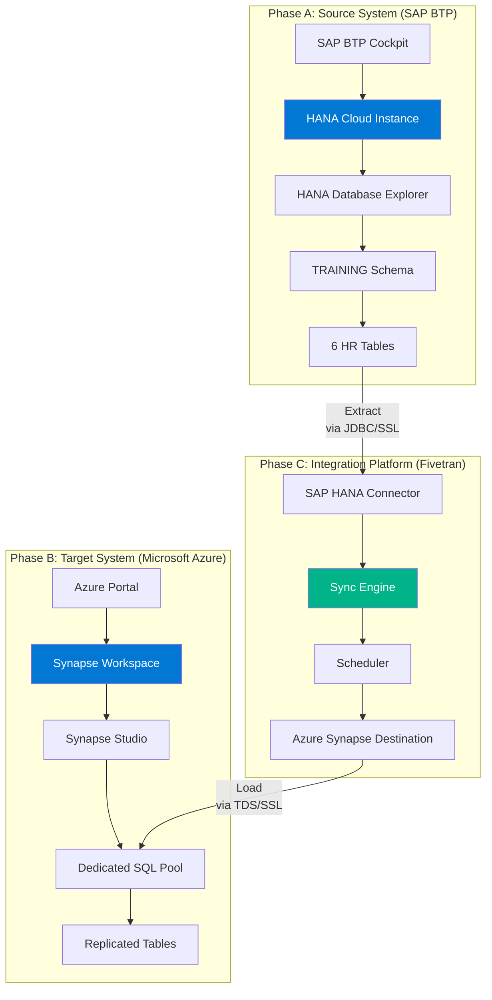
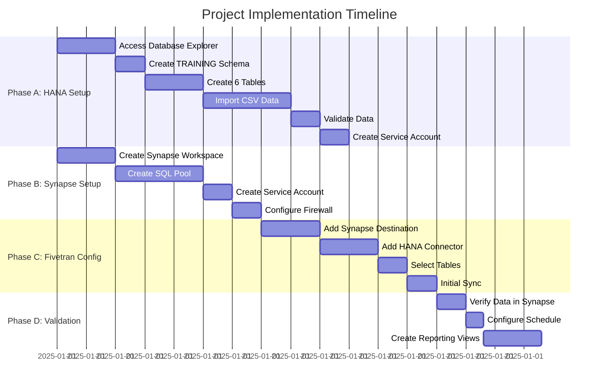
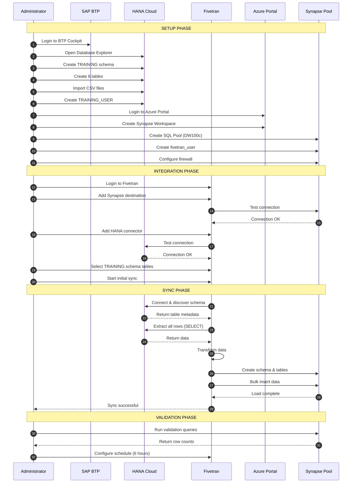
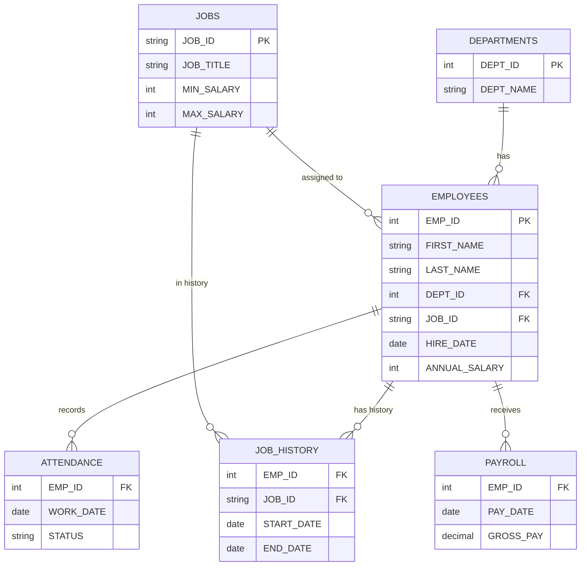
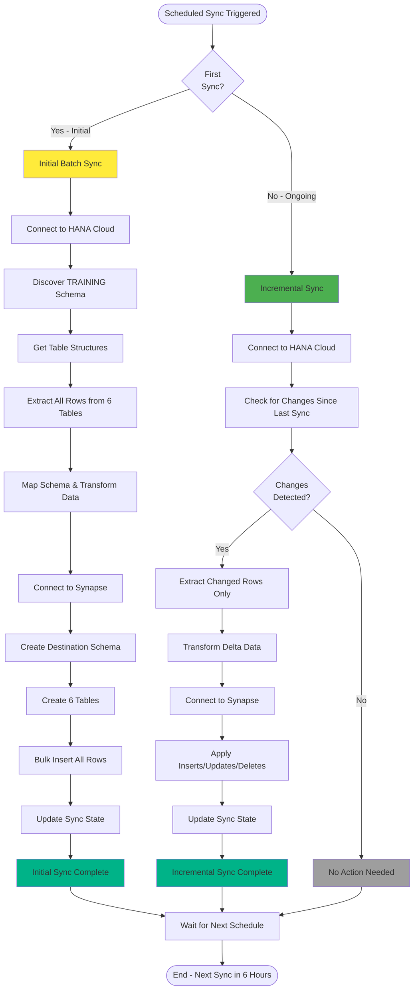
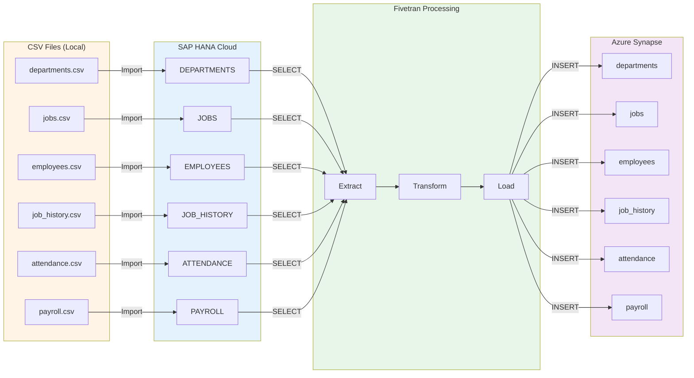
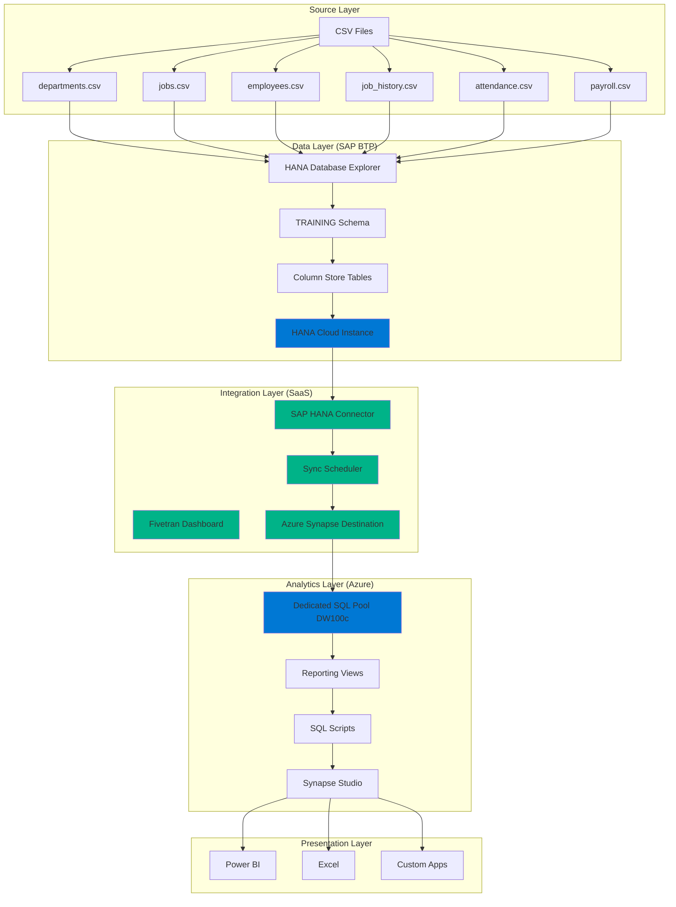
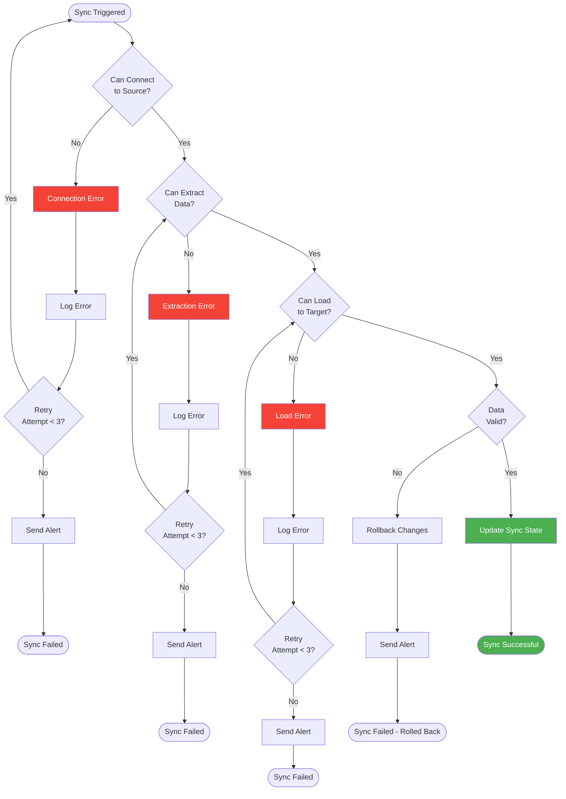

# Visual Diagrams - SAP BTP to Azure Synapse Integration

This document contains various visual representations of the project architecture and data flow.

---

## 1. High-Level Architecture (Mermaid)



---

## 2. Data Flow Timeline (Mermaid)



---

## 3. Component Interaction Diagram (Mermaid)



---

## 4. Table Relationships (Mermaid)



---

## 5. Sync Process Flow (Mermaid)



---

## 6. Network Security Architecture (ASCII)

```
NETWORK SECURITY ARCHITECTURE

┌─────────────────────────────────────────────────────────────────────────┐
│                          SECURITY PERIMETER                              │
└─────────────────────────────────────────────────────────────────────────┘

┌──────────────────────────┐                           ┌──────────────────────────┐
│   SAP BTP Environment    │                           │   Azure Environment      │
│                          │                           │                          │
│  ┌────────────────────┐  │                           │  ┌────────────────────┐  │
│  │ HANA Cloud         │  │                           │  │ Synapse Workspace  │  │
│  │ Firewall           │  │                           │  │ Firewall           │  │
│  │                    │  │                           │  │                    │  │
│  │ Allowed IPs:       │  │                           │  │ Allowed IPs:       │  │
│  │ ✓ Admin IP         │  │                           │  │ ✓ Admin IP         │  │
│  │ ✓ Fivetran IPs     │  │                           │  │ ✓ Fivetran IPs     │  │
│  │ ✗ All Others       │  │                           │  │ ✗ All Others       │  │
│  │                    │  │                           │  │                    │  │
│  └────────┬───────────┘  │                           │  └────────┬───────────┘  │
│           │              │                           │           │              │
│           ▼              │                           │           ▼              │
│  ┌────────────────────┐  │                           │  ┌────────────────────┐  │
│  │ SSL/TLS Layer      │  │◄─────────────┐   ┌───────┼─►│ SSL/TLS Layer      │  │
│  │ Port: 443          │  │              │   │       │  │ Port: 1433         │  │
│  └────────┬───────────┘  │              │   │       │  └────────┬───────────┘  │
│           │              │              │   │       │           │              │
│           ▼              │              │   │       │           ▼              │
│  ┌────────────────────┐  │              │   │       │  ┌────────────────────┐  │
│  │ Authentication     │  │              │   │       │  │ Authentication     │  │
│  │ User: TRAINING_    │  │              │   │       │  │ User: fivetran_    │  │
│  │       USER         │  │              │   │       │  │       user         │  │
│  │ Type: READ-ONLY    │  │              │   │       │  │ Type: DB_OWNER     │  │
│  └────────┬───────────┘  │              │   │       │  └────────┬───────────┘  │
│           │              │              │   │       │           │              │
│           ▼              │              │   │       │           ▼              │
│  ┌────────────────────┐  │              │   │       │  ┌────────────────────┐  │
│  │ TRAINING Schema    │  │              │   │       │  │ sap_hana_training  │  │
│  │ - 6 Tables         │  │              │   │       │  │ - 6 Tables         │  │
│  └────────────────────┘  │              │   │       │  └────────────────────┘  │
└──────────────────────────┘              │   │       └──────────────────────────┘
                                          │   │
                                          │   │
                                ┌─────────┴───┴────────┐
                                │  Fivetran Cloud      │
                                │  Platform            │
                                │                      │
                                │  ┌────────────────┐  │
                                │  │ SAP HANA       │  │
                                │  │ Connector      │  │
                                │  └────────────────┘  │
                                │         │            │
                                │         ▼            │
                                │  ┌────────────────┐  │
                                │  │ Sync Engine    │  │
                                │  │ - Encrypted    │  │
                                │  │ - Monitored    │  │
                                │  └────────────────┘  │
                                │         │            │
                                │         ▼            │
                                │  ┌────────────────┐  │
                                │  │ Azure Synapse  │  │
                                │  │ Destination    │  │
                                │  └────────────────┘  │
                                │                      │
                                │  Egress IPs:         │
                                │  - Must be allowed   │
                                │    in both firewalls │
                                └──────────────────────┘

SECURITY CONTROLS:
├─ SSL/TLS encryption on all connections
├─ Service accounts with minimal privileges
├─ IP allowlisting (deny all except specific IPs)
├─ Strong password policies enforced
├─ Audit logging enabled on both sides
└─ Schema isolation (separate from production data)
```

---

## 7. Data Journey Visualization (Mermaid)



---

## 8. Phase-by-Phase Implementation (ASCII)

```
PROJECT IMPLEMENTATION PHASES

╔═══════════════════════════════════════════════════════════════════════╗
║                        PHASE A: SOURCE PREPARATION                     ║
║                           (SAP HANA on BTP)                           ║
╚═══════════════════════════════════════════════════════════════════════╝

┌─────────────┐      ┌─────────────┐      ┌─────────────┐      ┌─────────────┐
│   Step 1    │ ───► │   Step 2    │ ───► │   Step 3    │ ───► │   Step 4    │
│             │      │             │      │             │      │             │
│   Access    │      │   Create    │      │   Create    │      │   Import    │
│   Database  │      │   Schema    │      │   Tables    │      │   CSV Data  │
│   Explorer  │      │             │      │   (6)       │      │   (6 files) │
└─────────────┘      └─────────────┘      └─────────────┘      └─────────────┘
                                                                        │
                                                                        ▼
┌─────────────┐      ┌─────────────┐                          ┌─────────────┐
│   Step 6    │ ◄─── │   Step 5    │ ◄─────────────────────── │   Step 4    │
│             │      │             │                          │   Complete  │
│   Create    │      │   Validate  │                          └─────────────┘
│   Service   │      │   Data      │
│   Account   │      │             │
└─────────────┘      └─────────────┘

Result: ✓ HANA schema ready with 6 populated tables


╔═══════════════════════════════════════════════════════════════════════╗
║                   PHASE B: DESTINATION PREPARATION                     ║
║                      (Azure Synapse Analytics)                        ║
╚═══════════════════════════════════════════════════════════════════════╝

┌─────────────┐      ┌─────────────┐      ┌─────────────┐      ┌─────────────┐
│   Step 7    │ ───► │   Step 8    │ ───► │   Step 9    │ ───► │   Step 10   │
│             │      │             │      │             │      │             │
│   Create    │      │   Create    │      │   Create    │      │   Configure │
│   Synapse   │      │   SQL Pool  │      │   Service   │      │   Network   │
│   Workspace │      │   (DW100c)  │      │   Account   │      │   Firewall  │
└─────────────┘      └─────────────┘      └─────────────┘      └─────────────┘

Result: ✓ Synapse SQL pool ready to receive data


╔═══════════════════════════════════════════════════════════════════════╗
║                     PHASE C: FIVETRAN CONFIGURATION                    ║
║                         (Integration Setup)                            ║
╚═══════════════════════════════════════════════════════════════════════╝

┌─────────────┐      ┌─────────────┐      ┌─────────────┐      ┌─────────────┐
│   Step 11   │ ───► │   Step 12   │ ───► │   Step 13   │ ───► │   Step 14   │
│             │      │             │      │             │      │             │
│   Add       │      │   Add       │      │   Select    │      │   Run       │
│   Synapse   │      │   HANA      │      │   6 Tables  │      │   Initial   │
│   Destination│     │   Connector │      │   to Sync   │      │   Sync      │
└─────────────┘      └─────────────┘      └─────────────┘      └─────────────┘

Result: ✓ Data replicated from HANA to Synapse


╔═══════════════════════════════════════════════════════════════════════╗
║                  PHASE D: VALIDATION & SCHEDULING                      ║
║                    (Ongoing Operations Setup)                          ║
╚═══════════════════════════════════════════════════════════════════════╝

┌─────────────┐      ┌─────────────┐      ┌─────────────┐
│   Step 15   │ ───► │   Step 16   │ ───► │   Step 17   │
│             │      │             │      │             │
│   Verify    │      │   Schedule  │      │   Create    │
│   Data in   │      │   Syncs     │      │   Reporting │
│   Synapse   │      │   (6 hours) │      │   Views     │
└─────────────┘      └─────────────┘      └─────────────┘

Result: ✓ Automated pipeline operational


═══════════════════════════════════════════════════════════════════════
                          PROJECT COMPLETE ✓
═══════════════════════════════════════════════════════════════════════
```

---

## 9. Technology Stack Visualization (Mermaid)



---

## 10. Sync Frequency Options (ASCII)

```
BATCH SYNC FREQUENCY OPTIONS

┌─────────────────────────────────────────────────────────────┐
│                   SYNC FREQUENCY MATRIX                      │
└─────────────────────────────────────────────────────────────┘

Option 1: EVERY 6 HOURS (Recommended for this project)
├─ 00:00 ────► Sync ────► 06:00 ────► Sync ────► 12:00
│                                                   │
│                                                   ▼
└─ 24:00 ◄──── Sync ◄──── 18:00 ◄──── Sync ◄──── 12:00

Pros: Fresh data 4x per day
Cons: Uses more Fivetran quota


Option 2: DAILY (Once per day)
└─ 02:00 AM ────► Sync ────► [Next day] 02:00 AM ────► Sync

Pros: Lower cost, less resource usage
Cons: Data could be 24 hours old


Option 3: CUSTOM (As needed)
└─ Configured based on business requirements

Examples:
  - Every hour during business hours
  - Multiple times during peak season
  - Once per week for static data


CURRENT PROJECT SETTING: Every 6 hours ⏰
RATIONALE: Balances freshness with cost for demo project
```

---

## 11. Error Handling Flow (Mermaid)



---

## 12. Project Success Metrics Dashboard (ASCII)

```
╔═══════════════════════════════════════════════════════════════╗
║              PROJECT SUCCESS METRICS DASHBOARD                 ║
╠═══════════════════════════════════════════════════════════════╣
║                                                               ║
║  SOURCE SYSTEM (SAP HANA)                                     ║
║  ┌───────────────────────────────────────────────────────┐   ║
║  │ Schema: TRAINING                            ✓ Online  │   ║
║  │ Tables: 6                                   ✓ Loaded  │   ║
║  │ Total Rows: ~500                            ✓ Valid   │   ║
║  │ Data Size: < 1 MB                                     │   ║
║  └───────────────────────────────────────────────────────┘   ║
║                                                               ║
║  INTEGRATION PLATFORM (FIVETRAN)                              ║
║  ┌───────────────────────────────────────────────────────┐   ║
║  │ Connector Status: Active                    ✓ Running │   ║
║  │ Last Sync: 2 hours ago                      ✓ Success │   ║
║  │ Next Sync: In 4 hours                                 │   ║
║  │ Sync Frequency: Every 6 hours                         │   ║
║  │ Rows Synced Today: 0 (no changes)                     │   ║
║  │ Initial Load: 2-5 minutes                   ✓ Complete│   ║
║  └───────────────────────────────────────────────────────┘   ║
║                                                               ║
║  TARGET SYSTEM (AZURE SYNAPSE)                                ║
║  ┌───────────────────────────────────────────────────────┐   ║
║  │ SQL Pool: fivetran_demo_pool                ✓ Online  │   ║
║  │ Schema: sap_hana_training                   ✓ Created │   ║
║  │ Tables: 6                                   ✓ Loaded  │   ║
║  │ Total Rows: ~500                            ✓ Match   │   ║
║  │ Data Freshness: 2 hours old                           │   ║
║  └───────────────────────────────────────────────────────┘   ║
║                                                               ║
║  DATA QUALITY                                                 ║
║  ┌───────────────────────────────────────────────────────┐   ║
║  │ Row Count Match:             100%           ✓ Pass    │   ║
║  │ Primary Keys Valid:          100%           ✓ Pass    │   ║
║  │ Foreign Keys Valid:          100%           ✓ Pass    │   ║
║  │ Null Values Expected:        Yes            ✓ Pass    │   ║
║  │ Data Types Preserved:        Yes            ✓ Pass    │   ║
║  └───────────────────────────────────────────────────────┘   ║
║                                                               ║
║  PROJECT STATUS: ✓ SUCCESSFULLY COMPLETED                     ║
║                                                               ║
╚═══════════════════════════════════════════════════════════════╝
```

---

## 13. Before & After Comparison (ASCII)

```
BEFORE vs AFTER PROJECT IMPLEMENTATION

╔════════════════════════════════════════╗  ╔════════════════════════════════════════╗
║           BEFORE PROJECT               ║  ║           AFTER PROJECT                ║
╠════════════════════════════════════════╣  ╠════════════════════════════════════════╣
║                                        ║  ║                                        ║
║  Data Location:                        ║  ║  Data Location:                        ║
║  └─ SAP HANA only                      ║  ║  ├─ SAP HANA (source)                  ║
║                                        ║  ║  └─ Azure Synapse (analytics)          ║
║                                        ║  ║                                        ║
║  Data Access:                          ║  ║  Data Access:                          ║
║  └─ HANA Database Explorer only        ║  ║  ├─ HANA Database Explorer             ║
║                                        ║  ║  ├─ Synapse Studio                     ║
║                                        ║  ║  ├─ Power BI                           ║
║                                        ║  ║  └─ Any SQL client                     ║
║                                        ║  ║                                        ║
║  Analytics Capability:                 ║  ║  Analytics Capability:                 ║
║  └─ Limited to HANA                    ║  ║  └─ Full Azure ecosystem               ║
║                                        ║  ║                                        ║
║  Data Refresh:                         ║  ║  Data Refresh:                         ║
║  └─ Manual effort required             ║  ║  └─ Automated every 6 hours            ║
║                                        ║  ║                                        ║
║  Integration:                          ║  ║  Integration:                          ║
║  └─ None                               ║  ║  └─ Fivetran pipeline                  ║
║                                        ║  ║                                        ║
║  Reporting:                            ║  ║  Reporting:                            ║
║  └─ Manual SQL queries                 ║  ║  └─ Automated dashboards possible      ║
║                                        ║  ║                                        ║
║  Data Freshness:                       ║  ║  Data Freshness:                       ║
║  └─ Real-time in HANA only             ║  ║  └─ Within 6 hours in Synapse          ║
║                                        ║  ║                                        ║
║  Scalability:                          ║  ║  Scalability:                          ║
║  └─ Limited by HANA instance           ║  ║  └─ Scalable DWU in Synapse            ║
║                                        ║  ║                                        ║
╚════════════════════════════════════════╝  ╚════════════════════════════════════════╝

TRANSFORMATION ACHIEVED: From siloed data → Integrated analytics platform
```

---

## Legend & Symbols

```
DIAGRAM SYMBOLS USED

┌─────┐
│ Box │  = Component or System
└─────┘

───►     = Data Flow Direction
◄───     = Reverse Direction

║        = Vertical Border
═        = Horizontal Border (emphasis)

✓        = Success / Completed
✗        = Failed / Blocked
⏰        = Scheduled / Timer
🔒       = Secured / Encrypted

[Component]  = Mermaid syntax for nodes
-->          = Mermaid syntax for flow
```

---

**Document Purpose:** Visual reference for project architecture and data flows  
**Diagram Types:** ASCII (text-based) and Mermaid (rendered graphics)  
**Usage:** Present in interviews, documentation, and portfolio  

---

**Created for:** Research Student (9 months experience)  
**Project:** SAP BTP to Azure Synapse Integration via Fivetran  
**Last Updated:** October 2025

